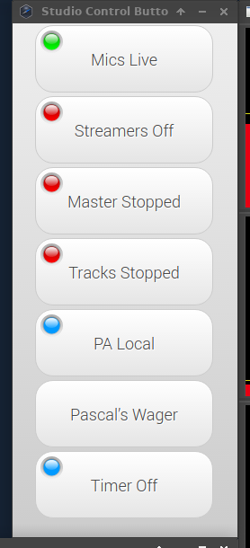

# toggler - a simple method to control and monitor linux subsystems

When opearing a radio studio, it is necessary to have a bunch of buttons that turn things on and off.   In 2014, this is quick solution I had to do that.   It takes a JSON config file and gives you a bunch of buttons that turn things on and off.  It is mostly designed to operate with [systemjack](https://github.com/refutationalist/systemjack), but it will work with anything that provides the right kind of JSON output.

### Usage

An example of how to use toggler is in the example directory, but it needs some changing to the test.json.template file before you use it.   When installing the Arch package, that change is done automatically.   If the package is installed, you can try out the example by:

	$ toggler --config=/usr/share/toggler/example/test.json
	
See that JSON file for configuration.   Better documentation is forthcoming.

#### HTTP Support

If `http` is set to an integer in the JSON file, it will open an HTTP server on localhost using that port number. 

Get toggle status with `http://localhost:[port]/?cmd=status`, and toggle switches with `http://localhost:<port>/?cmd=change&key=[key]`.  Examples of that will likely be forthcoming.

### Packaging

A fakey, crap method of creating an [Arch Linux](https://archlinux.org) package can be found in the package directory of this repo.   If you want to use this on other systems, that's a good place to start.  A real package might or might not be forthcoming as I plan to reimplement this in a way that doesn't burn so many resources.

### Screenshot

 

### Licensing

The stuff I wrote is AGPL3, but we use an SVG image for the LED indicator which can be found [here](https://openclipart.org/detail/183616/generic-round-led-by-morkaitehred-183616).

We also use some Google Fonts.  Fonts and licenses can be found in the directory.
